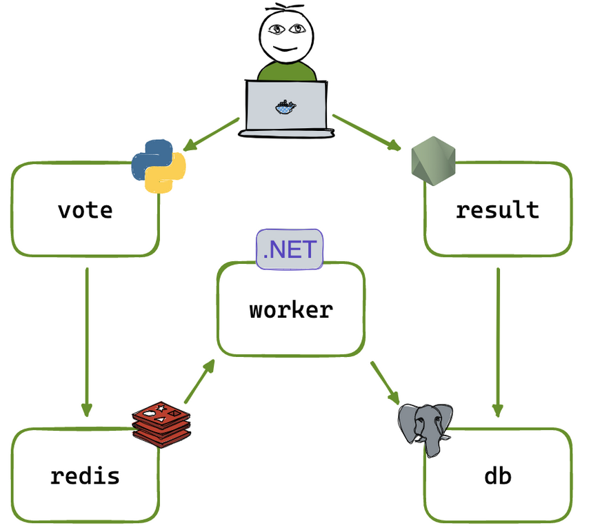

# Despliegue de Aplicación de Microservicios con Kubernetes

   

Este repositorio contiene un conjunto de manifiestos de Kubernetes para desplegar una aplicación de votación distribuida, basada en una arquitectura de microservicios. El proyecto demuestra la orquestación de contenedores, la configuración de redes internas y la gestión de la configuración y los secretos en un entorno de Kubernetes.

**➡️ [Ver la Documentación Técnica Detallada](DOCUMENTACION_DETALLADA.md)** 

---

### 🚀 Arquitectura de la Aplicación

La aplicación se compone de 5 servicios contenerizados que colaboran para ofrecer una experiencia de votación en tiempo real:

* **Vote App**: Un frontend web para que los usuarios emitan sus votos.
* **Redis**: Una base de datos en memoria que actúa como cola para los votos entrantes.
* **Worker**: Un servicio backend que procesa los votos de la cola de Redis.
* **Postgres DB**: Una base de datos relacional para el almacenamiento persistente de los votos.
* **Result App**: Un segundo frontend web que consulta la base de datos y muestra los resultados en vivo.



---

### 💡 Logros y Habilidades Demostradas (Fórmula XYZ)

* **Orquesté una aplicación completa de 5 microservicios**, garantizando la alta disponibilidad y el auto-reparado de cada componente, mediante la escritura de manifiestos declarativos para **Deployments** de Kubernetes.

* **Diseñé un sistema de comunicación de red robusto**, asegurando que las bases de datos permanecieran aisladas de la exposición externa, mediante el uso estratégico de `Services` de tipo **`ClusterIP`** para la comunicación interna y **`NodePort`** para las interfaces de usuario.

* **Centralicé y gestioné la configuración de la aplicación de forma segura**, permitiendo despliegues portátiles y eliminando credenciales del código fuente, mediante la inyección de datos desde objetos **`ConfigMap`** y **`Secret`** como variables de entorno.

* **Diagnostiqué y resolví un complejo problema de fallo en cascada**, superando errores de autenticación, DNS e incompatibilidades entre componentes, mediante el análisis sistemático de logs de aplicación y de servidor, y la inspección en vivo de los objetos del clúster con **`kubectl`**.

---

### 🛠️ Tecnologías Utilizadas

* **Orquestación**: Kubernetes (Minikube)
* **Contenerización**: Docker
* **Bases de Datos**: PostgreSQL, Redis
* **CI/CD**: `kubectl` para la aplicación de manifiestos

---

### ⚙️ Cómo Desplegar

**Prerrequisitos:**
* Tener [**Minikube**](https://minikube.sigs.k8s.io/docs/start/) instalado y en ejecución.
* Tener [**kubectl**](https://kubernetes.io/docs/tasks/tools/) instalado y configurado.

**Pasos:**
1.  Clona este repositorio:
    ```bash
    git clone [https://github.com/tu-usuario/tu-repositorio.git](https://github.com/tu-usuario/tu-repositorio.git)
    cd tu-repositorio
    ```

2.  Aplica todos los manifiestos de forma recursiva:
    ```bash
    kubectl apply -f . -R
    ```

3.  Verifica que todos los Pods estén en estado `Running`:
    ```bash
    kubectl get pods
    ```

4.  Accede a las aplicaciones. Minikube abrirá automáticamente las URLs en tu navegador:
    ```bash
    # Para la aplicación de votación
    minikube service vote-app-service

    # Para la aplicación de resultados
    minikube service result-service
    ```
