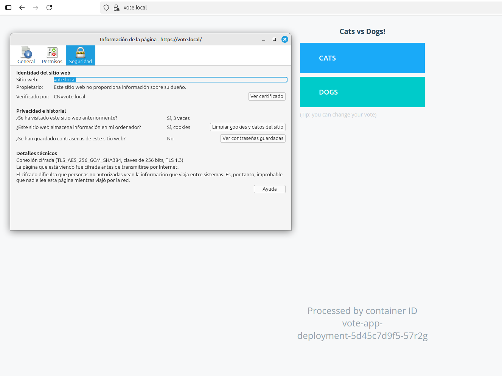
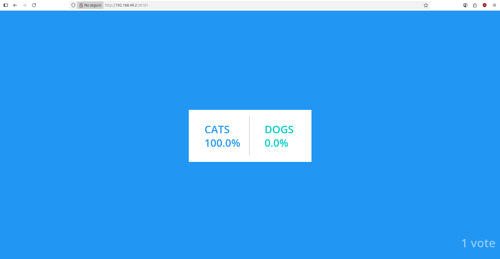

# Despliegue de Aplicación de Microservicios Segura con Kubernetes

    

Este repositorio contiene un conjunto de manifiestos de Kubernetes para desplegar una aplicación de votación distribuida y segura. El proyecto demuestra la orquestación de contenedores, la gestión de tráfico con Ingress, la securización con TLS y la implementación de una política de red de **confianza cero (Zero Trust)**.

**➡️ [Ver la Documentación Técnica Detallada](DOCUMENTACION_DETALLADA.md)**

---

### 🚀 Arquitectura y Flujo de Tráfico

La aplicación se compone de 5 servicios contenerizados. El tráfico externo es gestionado por un **Ingress Controller de NGINX**, mientras que la comunicación interna está estrictamente controlada por **Network Policies** que aseguran que cada componente solo pueda hablar con los servicios que necesita.


---

### 🖼️ Aplicación en Funcionamiento

Una vez desplegada, la aplicación expone dos interfaces web seguras (HTTPS), cada una en su propio dominio local.

#### **Interfaz de Votación (`https://vote.local`)**


#### **Interfaz de Resultados (`https://result.local`)**


---

### 💡 Logros y Habilidades Demostradas

* **Implementé un modelo de seguridad de red de Confianza Cero (Zero Trust)**, reduciendo drásticamente la superficie de ataque interna, mediante la escritura de **Network Policies** específicas que controlan el tráfico de `Ingress` y `Egress` para cada microservicio.

* **Orquesté una aplicación completa de 5 microservicios**, garantizando la alta disponibilidad y el auto-reparado de cada componente, mediante la escritura de manifiestos declarativos para **Deployments** de Kubernetes.

* **Implementé un punto de entrada único y seguro para todo el clúster**, centralizando la gestión del tráfico y habilitando la comunicación encriptada (HTTPS), mediante la configuración de un **Ingress Controller** y la gestión de certificados **TLS** almacenados en `Secrets`.

* **Diseñé un sistema de comunicación de red robusto**, asegurando que las bases de datos permanecieran aisladas de la exposición pública, mediante el uso estratégico de `Services` de tipo **`ClusterIP`** y el enrutamiento de capa 7 del **Ingress**.

* **Centralicé y gestioné la configuración de la aplicación de forma segura**, permitiendo despliegues portátiles y eliminando credenciales del código fuente, mediante la inyección de datos desde objetos **`ConfigMap`** y **`Secret`** como variables de entorno.

* **Diagnostiqué y resolví un complejo problema de fallo en cascada**, superando errores de autenticación, DNS e incompatibilidades entre componentes, mediante el análisis sistemático de logs de aplicación y de servidor, y la inspección en vivo de los objetos del clúster con **`kubectl`**.

---

### 🛠️ Tecnologías Utilizadas

* **Orquestación**: Kubernetes (Minikube)
* **Redes**: Ingress-NGINX, Calico (CNI)
* **Seguridad**: Network Policies, TLS/SSL (OpenSSL)
* **Contenerización**: Docker
* **Bases de Datos**: PostgreSQL, Redis
* **Despliegue**: `kubectl`

---

### ⚙️ Cómo Desplegar

**Prerrequisitos:**
* Tener [**Minikube**](https://minikube.sigs.k8s.io/docs/start/) instalado.
* Tener [**kubectl**](https://kubernetes.io/docs/tasks/tools/) instalado y configurado.

**Pasos:**
1.  **Inicia Minikube con el CNI de Calico.** Este paso es crucial para que las `Network Policies` se apliquen.
    ```bash
    minikube start --network-plugin=cni --cni=calico
    ```

2.  Clona este repositorio:
    ```bash
    git clone https://github.com/ualia946/k8s-voting-app-orchestration
    cd k8s-voting-app-orchestration
    ```

3.  Habilita el addon de Ingress en Minikube:
    ```bash
    minikube addons enable ingress
    ```

4.  Aplica todos los manifiestos de forma recursiva:
    ```bash
    kubectl apply -f . -R
    ```

5.  **Configura tu DNS local.** Obtén la IP de Minikube y añádela a tu fichero `/etc/hosts`.
    ```bash
    # 1. Obtén la IP
    minikube ip
    # 2. Edita el fichero de hosts con permisos de administrador
    sudo nano /etc/hosts
    # 3. Añade estas líneas al final (usando la IP que obtuviste)
    # 192.168.49.2  vote.local
    # 192.168.49.2  result.local
    ```

6.  **Accede a las aplicaciones** en tu navegador a través de HTTPS:
    * `https://vote.local`
    * `https://result.local`

    *(Nota: Tu navegador mostrará una advertencia de seguridad porque el certificado es autofirmado. Debes aceptarla para continuar).*